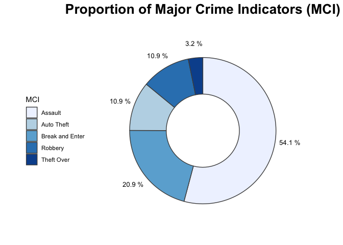
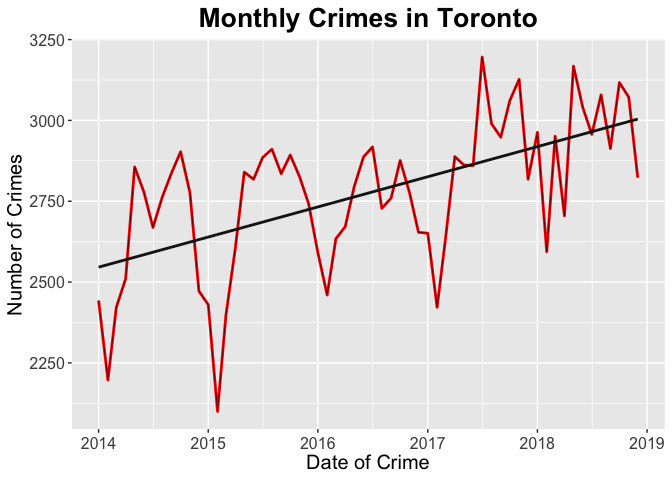
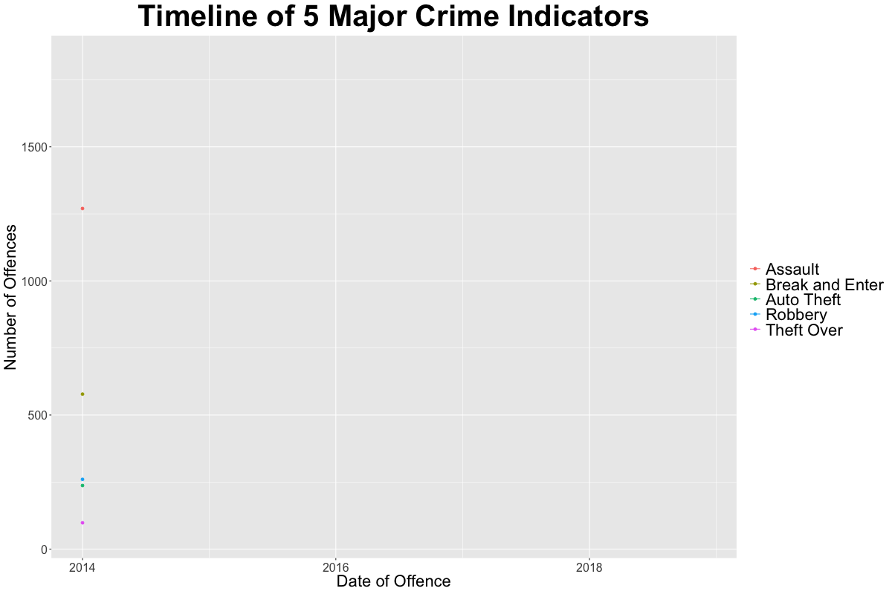
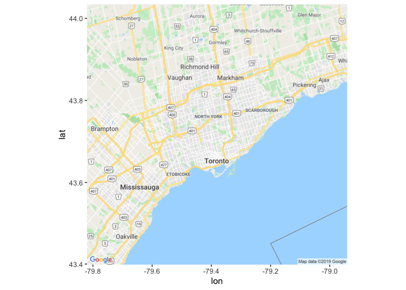
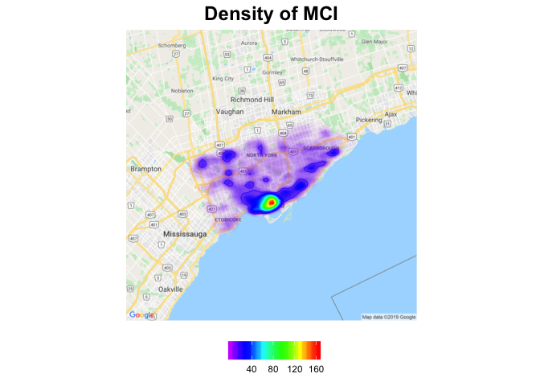
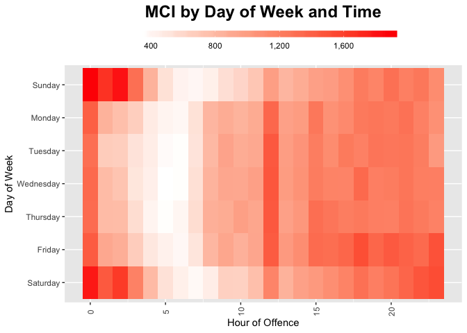

## Objectives  
* Prepare publically available dataset for analysis.
* Analyze Major Crime Indicators (MCIs) in Toronto from January 1, 2014 to December 31, 2018.
* Visualize time and geospatial data.  

### Install/Load packages

```r
if(!require('pacman')) install.packages('pacman')
pacman::p_load(tidyverse, dplyr, ggplot2, ggmap, ggrepel, gganimate, gifski, png, viridis, scales, kableExtra, gridExtra)
```

### Import the dataset  

The original dataset was obtained from Toronto Police Service PUBLIC SAFETY DATA PORTAL. Use of this dataset is in compliance with Open Government Licence - Ontario.  
To follow along, you may download the dataset here: [MCI 2014 to 2018](https://github.com/SiphuLangeni/Major-Crime-Indicators-in-Toronto/blob/master/Crime.csv.zip)


```r
Crime <- read.csv('Crime.csv')
dim(Crime)
```

```
## [1] 167525     29
```

```r
kable(head(Crime)) %>%
  kable_styling(bootstrap_options = 'striped', font_size = 12, full_width = F)
```

<table class="table table-striped" style="font-size: 12px; width: auto !important; margin-left: auto; margin-right: auto;">
 <thead>
  <tr>
   <th style="text-align:right;"> X </th>
   <th style="text-align:right;"> Y </th>
   <th style="text-align:right;"> Index_ </th>
   <th style="text-align:left;"> event_unique_id </th>
   <th style="text-align:left;"> occurrencedate </th>
   <th style="text-align:left;"> reporteddate </th>
   <th style="text-align:left;"> premisetype </th>
   <th style="text-align:right;"> ucr_code </th>
   <th style="text-align:right;"> ucr_ext </th>
   <th style="text-align:left;"> offence </th>
   <th style="text-align:right;"> reportedyear </th>
   <th style="text-align:left;"> reportedmonth </th>
   <th style="text-align:right;"> reportedday </th>
   <th style="text-align:right;"> reporteddayofyear </th>
   <th style="text-align:left;"> reporteddayofweek </th>
   <th style="text-align:right;"> reportedhour </th>
   <th style="text-align:right;"> occurrenceyear </th>
   <th style="text-align:left;"> occurrencemonth </th>
   <th style="text-align:right;"> occurrenceday </th>
   <th style="text-align:right;"> occurrencedayofyear </th>
   <th style="text-align:left;"> occurrencedayofweek </th>
   <th style="text-align:right;"> occurrencehour </th>
   <th style="text-align:left;"> MCI </th>
   <th style="text-align:left;"> Division </th>
   <th style="text-align:right;"> Hood_ID </th>
   <th style="text-align:left;"> Neighbourhood </th>
   <th style="text-align:right;"> Lat </th>
   <th style="text-align:right;"> Long </th>
   <th style="text-align:right;"> ObjectId </th>
  </tr>
 </thead>
<tbody>
  <tr>
   <td style="text-align:right;"> -79.38519 </td>
   <td style="text-align:right;"> 43.65923 </td>
   <td style="text-align:right;"> 2349 </td>
   <td style="text-align:left;"> GO-20149004286 </td>
   <td style="text-align:left;"> 2014-06-20T10:55:00.000Z </td>
   <td style="text-align:left;"> 2014-06-20T13:20:00.000Z </td>
   <td style="text-align:left;"> Apartment </td>
   <td style="text-align:right;"> 2130 </td>
   <td style="text-align:right;"> 210 </td>
   <td style="text-align:left;"> Theft Over </td>
   <td style="text-align:right;"> 2014 </td>
   <td style="text-align:left;"> June </td>
   <td style="text-align:right;"> 20 </td>
   <td style="text-align:right;"> 171 </td>
   <td style="text-align:left;"> Friday </td>
   <td style="text-align:right;"> 13 </td>
   <td style="text-align:right;"> 2014 </td>
   <td style="text-align:left;"> June </td>
   <td style="text-align:right;"> 20 </td>
   <td style="text-align:right;"> 171 </td>
   <td style="text-align:left;"> Friday </td>
   <td style="text-align:right;"> 10 </td>
   <td style="text-align:left;"> Theft Over </td>
   <td style="text-align:left;"> D52 </td>
   <td style="text-align:right;"> 76 </td>
   <td style="text-align:left;"> Bay Street Corridor (76) </td>
   <td style="text-align:right;"> 43.65923 </td>
   <td style="text-align:right;"> -79.38519 </td>
   <td style="text-align:right;"> 2001 </td>
  </tr>
  <tr>
   <td style="text-align:right;"> -79.42540 </td>
   <td style="text-align:right;"> 43.77759 </td>
   <td style="text-align:right;"> 2350 </td>
   <td style="text-align:left;"> GO-20142411379 </td>
   <td style="text-align:left;"> 2014-07-02T00:20:00.000Z </td>
   <td style="text-align:left;"> 2014-07-02T02:58:00.000Z </td>
   <td style="text-align:left;"> Outside </td>
   <td style="text-align:right;"> 1457 </td>
   <td style="text-align:right;"> 100 </td>
   <td style="text-align:left;"> Pointing A Firearm </td>
   <td style="text-align:right;"> 2014 </td>
   <td style="text-align:left;"> July </td>
   <td style="text-align:right;"> 2 </td>
   <td style="text-align:right;"> 183 </td>
   <td style="text-align:left;"> Wednesday </td>
   <td style="text-align:right;"> 2 </td>
   <td style="text-align:right;"> 2014 </td>
   <td style="text-align:left;"> July </td>
   <td style="text-align:right;"> 2 </td>
   <td style="text-align:right;"> 183 </td>
   <td style="text-align:left;"> Wednesday </td>
   <td style="text-align:right;"> 0 </td>
   <td style="text-align:left;"> Assault </td>
   <td style="text-align:left;"> D32 </td>
   <td style="text-align:right;"> 36 </td>
   <td style="text-align:left;"> Newtonbrook West (36) </td>
   <td style="text-align:right;"> 43.77759 </td>
   <td style="text-align:right;"> -79.42540 </td>
   <td style="text-align:right;"> 2002 </td>
  </tr>
  <tr>
   <td style="text-align:right;"> -79.42540 </td>
   <td style="text-align:right;"> 43.77759 </td>
   <td style="text-align:right;"> 2351 </td>
   <td style="text-align:left;"> GO-20142411379 </td>
   <td style="text-align:left;"> 2014-07-02T00:20:00.000Z </td>
   <td style="text-align:left;"> 2014-07-02T02:58:00.000Z </td>
   <td style="text-align:left;"> Outside </td>
   <td style="text-align:right;"> 1610 </td>
   <td style="text-align:right;"> 100 </td>
   <td style="text-align:left;"> Robbery With Weapon </td>
   <td style="text-align:right;"> 2014 </td>
   <td style="text-align:left;"> July </td>
   <td style="text-align:right;"> 2 </td>
   <td style="text-align:right;"> 183 </td>
   <td style="text-align:left;"> Wednesday </td>
   <td style="text-align:right;"> 2 </td>
   <td style="text-align:right;"> 2014 </td>
   <td style="text-align:left;"> July </td>
   <td style="text-align:right;"> 2 </td>
   <td style="text-align:right;"> 183 </td>
   <td style="text-align:left;"> Wednesday </td>
   <td style="text-align:right;"> 0 </td>
   <td style="text-align:left;"> Robbery </td>
   <td style="text-align:left;"> D32 </td>
   <td style="text-align:right;"> 36 </td>
   <td style="text-align:left;"> Newtonbrook West (36) </td>
   <td style="text-align:right;"> 43.77759 </td>
   <td style="text-align:right;"> -79.42540 </td>
   <td style="text-align:right;"> 2003 </td>
  </tr>
  <tr>
   <td style="text-align:right;"> -79.21037 </td>
   <td style="text-align:right;"> 43.80173 </td>
   <td style="text-align:right;"> 2352 </td>
   <td style="text-align:left;"> GO-20142412127 </td>
   <td style="text-align:left;"> 2014-07-02T01:30:00.000Z </td>
   <td style="text-align:left;"> 2014-07-02T05:40:00.000Z </td>
   <td style="text-align:left;"> House </td>
   <td style="text-align:right;"> 2120 </td>
   <td style="text-align:right;"> 200 </td>
   <td style="text-align:left;"> B&amp;E </td>
   <td style="text-align:right;"> 2014 </td>
   <td style="text-align:left;"> July </td>
   <td style="text-align:right;"> 2 </td>
   <td style="text-align:right;"> 183 </td>
   <td style="text-align:left;"> Wednesday </td>
   <td style="text-align:right;"> 5 </td>
   <td style="text-align:right;"> 2014 </td>
   <td style="text-align:left;"> July </td>
   <td style="text-align:right;"> 2 </td>
   <td style="text-align:right;"> 183 </td>
   <td style="text-align:left;"> Wednesday </td>
   <td style="text-align:right;"> 1 </td>
   <td style="text-align:left;"> Break and Enter </td>
   <td style="text-align:left;"> D42 </td>
   <td style="text-align:right;"> 132 </td>
   <td style="text-align:left;"> Malvern (132) </td>
   <td style="text-align:right;"> 43.80173 </td>
   <td style="text-align:right;"> -79.21037 </td>
   <td style="text-align:right;"> 2004 </td>
  </tr>
  <tr>
   <td style="text-align:right;"> -79.25433 </td>
   <td style="text-align:right;"> 43.83588 </td>
   <td style="text-align:right;"> 2354 </td>
   <td style="text-align:left;"> GO-20142417548 </td>
   <td style="text-align:left;"> 2014-07-02T20:52:00.000Z </td>
   <td style="text-align:left;"> 2014-07-02T20:57:00.000Z </td>
   <td style="text-align:left;"> Commercial </td>
   <td style="text-align:right;"> 1430 </td>
   <td style="text-align:right;"> 100 </td>
   <td style="text-align:left;"> Assault </td>
   <td style="text-align:right;"> 2014 </td>
   <td style="text-align:left;"> July </td>
   <td style="text-align:right;"> 2 </td>
   <td style="text-align:right;"> 183 </td>
   <td style="text-align:left;"> Wednesday </td>
   <td style="text-align:right;"> 20 </td>
   <td style="text-align:right;"> 2014 </td>
   <td style="text-align:left;"> July </td>
   <td style="text-align:right;"> 2 </td>
   <td style="text-align:right;"> 183 </td>
   <td style="text-align:left;"> Wednesday </td>
   <td style="text-align:right;"> 20 </td>
   <td style="text-align:left;"> Assault </td>
   <td style="text-align:left;"> D42 </td>
   <td style="text-align:right;"> 130 </td>
   <td style="text-align:left;"> Milliken (130) </td>
   <td style="text-align:right;"> 43.83588 </td>
   <td style="text-align:right;"> -79.25433 </td>
   <td style="text-align:right;"> 2005 </td>
  </tr>
  <tr>
   <td style="text-align:right;"> -79.27382 </td>
   <td style="text-align:right;"> 43.70997 </td>
   <td style="text-align:right;"> 2355 </td>
   <td style="text-align:left;"> GO-20142524077 </td>
   <td style="text-align:left;"> 2014-07-18T00:01:00.000Z </td>
   <td style="text-align:left;"> 2014-07-18T17:36:00.000Z </td>
   <td style="text-align:left;"> House </td>
   <td style="text-align:right;"> 2120 </td>
   <td style="text-align:right;"> 200 </td>
   <td style="text-align:left;"> B&amp;E </td>
   <td style="text-align:right;"> 2014 </td>
   <td style="text-align:left;"> July </td>
   <td style="text-align:right;"> 18 </td>
   <td style="text-align:right;"> 199 </td>
   <td style="text-align:left;"> Friday </td>
   <td style="text-align:right;"> 17 </td>
   <td style="text-align:right;"> 2014 </td>
   <td style="text-align:left;"> July </td>
   <td style="text-align:right;"> 18 </td>
   <td style="text-align:right;"> 199 </td>
   <td style="text-align:left;"> Friday </td>
   <td style="text-align:right;"> 0 </td>
   <td style="text-align:left;"> Break and Enter </td>
   <td style="text-align:left;"> D41 </td>
   <td style="text-align:right;"> 120 </td>
   <td style="text-align:left;"> Clairlea-Birchmount (120) </td>
   <td style="text-align:right;"> 43.70997 </td>
   <td style="text-align:right;"> -79.27382 </td>
   <td style="text-align:right;"> 2006 </td>
  </tr>
</tbody>
</table>

## Pre-processing  

Some of the attributes will not be used in the analysis so they will be dropped. A total of eleven attributes will remain. The columns are also rearranged for aesthetics.

```r
Crime <- Crime[,-c((1:4), (6:9), (11:16), 20, 24, 25, 29)]
Crime <- Crime[, c(8, 2, 1, 3:7, 9:11)]
kable(head(Crime)) %>%
  kable_styling(bootstrap_options = 'striped', font_size = 12, full_width = F)
```

<table class="table table-striped" style="font-size: 12px; width: auto !important; margin-left: auto; margin-right: auto;">
 <thead>
  <tr>
   <th style="text-align:left;"> MCI </th>
   <th style="text-align:left;"> offence </th>
   <th style="text-align:left;"> occurrencedate </th>
   <th style="text-align:right;"> occurrenceyear </th>
   <th style="text-align:left;"> occurrencemonth </th>
   <th style="text-align:right;"> occurrenceday </th>
   <th style="text-align:left;"> occurrencedayofweek </th>
   <th style="text-align:right;"> occurrencehour </th>
   <th style="text-align:left;"> Neighbourhood </th>
   <th style="text-align:right;"> Lat </th>
   <th style="text-align:right;"> Long </th>
  </tr>
 </thead>
<tbody>
  <tr>
   <td style="text-align:left;"> Theft Over </td>
   <td style="text-align:left;"> Theft Over </td>
   <td style="text-align:left;"> 2014-06-20T10:55:00.000Z </td>
   <td style="text-align:right;"> 2014 </td>
   <td style="text-align:left;"> June </td>
   <td style="text-align:right;"> 20 </td>
   <td style="text-align:left;"> Friday </td>
   <td style="text-align:right;"> 10 </td>
   <td style="text-align:left;"> Bay Street Corridor (76) </td>
   <td style="text-align:right;"> 43.65923 </td>
   <td style="text-align:right;"> -79.38519 </td>
  </tr>
  <tr>
   <td style="text-align:left;"> Assault </td>
   <td style="text-align:left;"> Pointing A Firearm </td>
   <td style="text-align:left;"> 2014-07-02T00:20:00.000Z </td>
   <td style="text-align:right;"> 2014 </td>
   <td style="text-align:left;"> July </td>
   <td style="text-align:right;"> 2 </td>
   <td style="text-align:left;"> Wednesday </td>
   <td style="text-align:right;"> 0 </td>
   <td style="text-align:left;"> Newtonbrook West (36) </td>
   <td style="text-align:right;"> 43.77759 </td>
   <td style="text-align:right;"> -79.42540 </td>
  </tr>
  <tr>
   <td style="text-align:left;"> Robbery </td>
   <td style="text-align:left;"> Robbery With Weapon </td>
   <td style="text-align:left;"> 2014-07-02T00:20:00.000Z </td>
   <td style="text-align:right;"> 2014 </td>
   <td style="text-align:left;"> July </td>
   <td style="text-align:right;"> 2 </td>
   <td style="text-align:left;"> Wednesday </td>
   <td style="text-align:right;"> 0 </td>
   <td style="text-align:left;"> Newtonbrook West (36) </td>
   <td style="text-align:right;"> 43.77759 </td>
   <td style="text-align:right;"> -79.42540 </td>
  </tr>
  <tr>
   <td style="text-align:left;"> Break and Enter </td>
   <td style="text-align:left;"> B&amp;E </td>
   <td style="text-align:left;"> 2014-07-02T01:30:00.000Z </td>
   <td style="text-align:right;"> 2014 </td>
   <td style="text-align:left;"> July </td>
   <td style="text-align:right;"> 2 </td>
   <td style="text-align:left;"> Wednesday </td>
   <td style="text-align:right;"> 1 </td>
   <td style="text-align:left;"> Malvern (132) </td>
   <td style="text-align:right;"> 43.80173 </td>
   <td style="text-align:right;"> -79.21037 </td>
  </tr>
  <tr>
   <td style="text-align:left;"> Assault </td>
   <td style="text-align:left;"> Assault </td>
   <td style="text-align:left;"> 2014-07-02T20:52:00.000Z </td>
   <td style="text-align:right;"> 2014 </td>
   <td style="text-align:left;"> July </td>
   <td style="text-align:right;"> 2 </td>
   <td style="text-align:left;"> Wednesday </td>
   <td style="text-align:right;"> 20 </td>
   <td style="text-align:left;"> Milliken (130) </td>
   <td style="text-align:right;"> 43.83588 </td>
   <td style="text-align:right;"> -79.25433 </td>
  </tr>
  <tr>
   <td style="text-align:left;"> Break and Enter </td>
   <td style="text-align:left;"> B&amp;E </td>
   <td style="text-align:left;"> 2014-07-18T00:01:00.000Z </td>
   <td style="text-align:right;"> 2014 </td>
   <td style="text-align:left;"> July </td>
   <td style="text-align:right;"> 18 </td>
   <td style="text-align:left;"> Friday </td>
   <td style="text-align:right;"> 0 </td>
   <td style="text-align:left;"> Clairlea-Birchmount (120) </td>
   <td style="text-align:right;"> 43.70997 </td>
   <td style="text-align:right;"> -79.27382 </td>
  </tr>
</tbody>
</table>

### Null Values

```r
colSums(is.na(Crime))
```

```
##                 MCI             offence      occurrencedate      occurrenceyear 
##                   0                   0                   0                  49 
##     occurrencemonth       occurrenceday occurrencedayofweek      occurrencehour 
##                   0                  49                   0                   0 
##       Neighbourhood                 Lat                Long 
##                   0                   0                   0
```

There are 49 null values in the columns occurrenceyear and occurrenceday. They will be dropped from the dataset by subsetting complete records. All records that occurred before 2014 will be removed since the dataset represents the five years spanning from 2014 to 2018.


```r
Crime <- Crime[complete.cases(Crime), ]
Crime <- (Crime[Crime$occurrenceyear >= '2014', ])
dim(Crime)
```

```
## [1] 166500     11
```

The final dataset has 166,500 records ( > 99% of the original dataset). Finally, let's reindex the rows.


```r
rownames(Crime) = 1:(length(rownames(Crime)))
```

## Analysis/Visualization

### Donut Plot
Let's determine how many types and proportion of MCI documented in the dataset.


```r
# Subset by MCIs
Crime_cat <- Crime %>%
  select(MCI) %>%
  group_by(MCI) %>%
  summarize(count = n()) %>%
  arrange(desc(count))

Crime_cat$pct <- Crime_cat$count / sum(Crime_cat$count)
Crime_cat$ymax <- cumsum(Crime_cat$pct)
Crime_cat$ymin <- c(0, head(Crime_cat$ymax, n = -1))
Crime_cat$labelPosition <- (Crime_cat$ymax + Crime_cat$ymin) / 2
Crime_cat$label <- paste(round(Crime_cat$pct, 3) * 100, '%')

# Donut plot
MCI <- Crime_cat %>%
  ggplot(aes(ymax = ymax, ymin = ymin, xmax = 3.5, xmin = 2.5, fill = MCI)) +
  geom_text(x = 3.9, aes(y = Crime_cat$labelPosition, label = Crime_cat$label), size = 3.5) +
  labs(title = 'Proportion of Major Crime Indicators (MCI)') +
  geom_rect(color = 'grey30') +
  scale_fill_brewer() +
  scale_color_brewer() +
  coord_polar(theta = 'y') +
  xlim(c(1.5, 4)) +
  theme_void() +
  theme(
    legend.position = 'left',
    plot.title = element_text(size = 20, face = 'bold', hjust = 0.5, vjust = 1)
  )

plot(MCI)
```

<!-- -->

## By Time  
### Time Series Plot  

Let's see the frequency of MCIs over time. Each data point represents one month. This gives us a total of 60 data points in the five year period.


```r
# Monthly Crime
Crime_month <- Crime %>%
  mutate(Date = as.Date(paste(substr(Crime$occurrencedate, 1, 7), '-01', sep = ''), '%Y-%m-%d')) %>%
  group_by(Date) %>%
  summarize(count = n()) %>%
  arrange(Date)

# Time Series Plot
Series <- Crime_month %>%
  ggplot(aes(x = Date, y = count)) +
  geom_line(color = 'red', size = 1) +
  scale_x_date(breaks = date_breaks('1 year'), labels = date_format('%Y')) +
  geom_line(color = 'black', size = 0.2) +
  geom_smooth(method = lm, se = FALSE, color = '#1A1A1A') +
  theme(
    legend.position = 'none',
    plot.title = element_text(size = 20, face = 'bold', hjust = 0.5, vjust = 1),
    axis.text.x = element_text(size = 12, vjust = 0.5),  
    axis.text.y = element_text(size = 12) ,
    axis.title.x=element_text(size = 15),
    axis.title.y=element_text(size = 15)
  ) +
  labs(title = 'Monthly Crimes in Toronto') +
  xlab('Date of Crime') +
  ylab('Number of Crimes')

plot(Series)
```

<!-- -->
Crime is definitely on the rise. We can identify an overall upward trend. At the same time, we see some seasonality within the data, with very apparent lows in February of each year.  

### MCI Over Time Animation

Now let's look at the same time series but lets consider each MCI individually. This is to assess how each MCI may be contributing to the increase in crime seen in the previous plot.


```r
# Subset by monthly MCIs
Crime_month_each <- Crime %>%
  select(MCI) %>%
  mutate(Date = as.Date(paste(substr(Crime$occurrencedate, 1, 7), '-01', sep = ''), '%Y-%m-%d')) %>%
  group_by(Date, MCI) %>%
  summarize(count = n()) %>%
  arrange(Date)
  
# Reorder levels so the legend appears in descencing order
Crime_month_each$MCI <- factor(Crime_month_each$MCI, levels = c('Assault', 'Break and Enter', 'Auto Theft', 'Robbery', 'Theft Over'))

# Animated Time Series per MCI
MCIseries <- Crime_month_each %>%
  ggplot(aes(x = Date, y = count, group = MCI, color = MCI)) +
  geom_line() +
  geom_point() +
  ggtitle('Timeline of 5 Major Crime Indicators') +
  xlab('Date of Offence') +
  ylab('Number of Offences') +
  transition_reveal(Date) + 
  theme(
    plot.title = element_text(size = 40, face = 'bold', hjust = 0.5, vjust = 1),
    axis.text.x = element_text(size = 16, vjust = 0.5),  
    axis.text.y = element_text(size = 16),
    axis.title.x=element_text(size = 22),
    axis.title.y=element_text(size = 22),
    legend.title = element_blank(),
    legend.key = element_rect(fill = 'NA'),
    legend.text = element_text(size = 22)
  )
# Render GIF
animate(MCIseries, fps = 24, duration = 7.5, width = 1200, height = 800, 
        renderer = gifski_renderer('MCIseries.gif'))
```

<!-- -->

### Hourly Crime Animation  

Let's take a look at the top 10 offences (sub-category of MCI) and see if we can gain any insight about the time of day various crimes occur.


```r
# Crimes by the hour
Crime_hour <- Crime %>%
  select(offence, occurrencehour) %>%
  group_by(occurrencehour, offence) %>%
  summarize(count = n())

Crime_hour_rank <- Crime_hour %>%
  group_by(occurrencehour) %>%
  mutate(rank = rank(-count),
         count_rel = count / count[rank == 1],
         count_lbl = paste0(' ', count)) %>%
  group_by(offence) %>%
  filter(rank <= 10) %>%
  ungroup()

# Static Plot
staticplot = ggplot(Crime_hour_rank, aes(rank, group = offence, 
                                         fill = as.factor(offence), color = as.factor(offence))) +
  geom_tile(aes(y = count / 2,
                height = count,
                width = 0.9), alpha = 0.8, color = NA) +
  geom_text(aes(y = 0, label = paste(offence, ' ')), vjust = 0.2, hjust = 1, size = 6) +
  geom_text(aes(y = count, label = count_lbl, hjust = 0, size = 6)) +
  coord_flip(clip = 'off', expand = FALSE) +
  scale_y_continuous(labels = scales::comma) +
  scale_x_reverse() +
  guides(color = FALSE, fill = FALSE) +
  theme(axis.line = element_blank(),
        axis.text.x = element_blank(),
        axis.text.y = element_blank(),
        axis.ticks = element_blank(),
        axis.title.x = element_blank(),
        axis.title.y = element_blank(),
        legend.position = 'none',
        panel.background = element_blank(),
        panel.border = element_blank(),
        panel.grid.major = element_blank(),
        panel.grid.minor = element_blank(),
        panel.grid.major.x = element_line(size = 0.1, color = 'grey'),
        panel.grid.minor.x = element_line(size = 0.1, color = 'grey'),
        plot.title = element_text(size = 40, hjust = 0.5, face = 'bold', color = 'grey', vjust = 0),
        plot.subtitle = element_text(size = 24, hjust = 0.5, vjust = 0, face = 'italic', color = 'grey'),
        plot.caption = element_text(size = 12, hjust = 0.5, face = 'italic', color = 'grey'),
        plot.background = element_blank(),
        plot.margin = margin(2, 2, 2, 12, 'cm'))

# Animation
anim = staticplot + transition_states(occurrencehour, transition_length = 3, state_length = 1) +
  view_follow(fixed_x = TRUE)  +
  labs(title = 'Crimes by Hour  {closest_state}:00',  
       subtitle = 'Top 10 Crimes',
       caption  = 'Data Source: Toronto Police Service Public Safety Data Portal')

# Export to GIF
animate(anim, fps = 24, duration = 36, width = 800, height = 600, 
        renderer = gifski_renderer('Crimes per hour.gif'))
```

<!-- -->

## Geospatial  

In order to use ggmaps, you must enter your Google API key using the following code: 
  
  
register_google(key = 'Your API key here')


```r
# Confirm the key is saved in the session
has_google_key()
```

```
## [1] TRUE
```

Let's determine where the center of our map should be. We also find the outer bounds where reporting took place to ensure that we choose a map size that includes all the data.

```r
# Ensure plots do not exceed bounding box
Bounds <- setNames(
  data.frame(c(mean(c(min(Crime$Long), max(Crime$Long))), mean(c(min(Crime$Lat),
  max(Crime$Lat))), min(Crime$Long), max(Crime$Long), min(Crime$Lat),
  max(Crime$Lat)), row.names = c('Mean Long', 'Mean Lat', 'Min Long',
                                 'Max Long', 'Min Lat', 'Max Lat')), 'Bounds')

kable(Bounds) %>%
  kable_styling(bootstrap_options = 'striped', font_size = 12, full_width = F)
```

<table class="table table-striped" style="font-size: 12px; width: auto !important; margin-left: auto; margin-right: auto;">
 <thead>
  <tr>
   <th style="text-align:left;">   </th>
   <th style="text-align:right;"> Bounds </th>
  </tr>
 </thead>
<tbody>
  <tr>
   <td style="text-align:left;"> Mean Long </td>
   <td style="text-align:right;"> -79.38118 </td>
  </tr>
  <tr>
   <td style="text-align:left;"> Mean Lat </td>
   <td style="text-align:right;"> 43.71752 </td>
  </tr>
  <tr>
   <td style="text-align:left;"> Min Long </td>
   <td style="text-align:right;"> -79.63927 </td>
  </tr>
  <tr>
   <td style="text-align:left;"> Max Long </td>
   <td style="text-align:right;"> -79.12310 </td>
  </tr>
  <tr>
   <td style="text-align:left;"> Min Lat </td>
   <td style="text-align:right;"> 43.58709 </td>
  </tr>
  <tr>
   <td style="text-align:left;"> Max Lat </td>
   <td style="text-align:right;"> 43.84795 </td>
  </tr>
</tbody>
</table>

### Retrieve map

Now that we have determined where our map should fall, we can call a static map using Google Geolocation API. The center of the map is at Long -79.38118, Lat 43.71752. Zoom of ten seems to be adequate based on our data points.

```r
TO <- get_map(location = c(Bounds$Bounds[1], Bounds$Bounds[2]), zoom = 10, maptype = 'roadmap')

plot(ggmap(TO))
```

<!-- -->

### Density Map of MCI

```r
MCI_Dense <- ggmap(TO) +
  geom_density2d(data = Crime, aes(x = Long, y = Lat), size = 0.4) + 
  stat_density2d(data = Crime,
                 aes(x = Long, y = Lat, fill = ..level.., alpha = ..level..), color = FALSE,
                 bins = 300, geom = 'polygon') +
  scale_fill_gradientn(colors = c(rev(rainbow(100, start=0, end=.8)))) +
  scale_alpha(range = c(0, 0.6), guide = FALSE) +
  labs(title = 'Density of MCI') +
  theme(axis.line = element_blank(),
      axis.text.x = element_blank(),
      axis.text.y = element_blank(),
      axis.ticks = element_blank(),
      axis.title.x = element_blank(),
      axis.title.y = element_blank(),
      legend.title = element_blank(),
      legend.position = 'bottom',
      plot.title = element_text(size = 18, hjust = 0.5, face = 'bold')
      )

plot(MCI_Dense)
```

<!-- -->


### Weekdays vs Time

```r
# Remove unused levels and whitespace from levels, re-order levels
Crime$occurrencedayofweek <- droplevels(Crime$occurrencedayofweek)
levels(Crime$occurrencedayofweek) <- trimws(levels(Crime$occurrencedayofweek))
Crime$occurrencedayofweek <-
  factor(Crime$occurrencedayofweek,
         levels = c('Saturday', 'Friday', 'Thursday', 'Wednesday',
                    'Tuesday', 'Monday', 'Sunday'))

levels(Crime$occurrencedayofweek)
```

```
## [1] "Saturday"  "Friday"    "Thursday"  "Wednesday" "Tuesday"   "Monday"   
## [7] "Sunday"
```

```r
DayVTime <- Crime %>%
  select(occurrencedayofweek, occurrencehour) %>%
  group_by(occurrencedayofweek, occurrencehour) %>%
  summarize(count = n())
```


#### Heatmap  

```r
MCI_Heat <- DayVTime %>%
  ggplot(aes(x = occurrencehour, y = occurrencedayofweek, fill = count)) +
  geom_tile() +
  theme(
    axis.text.x = element_text(angle = 90, vjust = 0.6),
    legend.title = element_blank(),
    legend.position="top",
    legend.direction="horizontal",
    legend.key.width=unit(2, "cm"),
    legend.key.height=unit(0.25, "cm"),
    plot.title = element_text(size = 18, face = 'bold', hjust = 0.5, vjust = 1)) +
  labs(x = "Hour of Offence", y = "Day of Week", title = 'MCI by Day of Week and Time') +
  scale_fill_gradient(low = 'white', high = 'red', labels = comma)

plot(MCI_Heat)
```

<!-- -->

This may be a good time to subset the data by MCI so we can perform the same analysis by place and time for each individual MCI.

```r
# Assault
Assault <- Crime %>%
  filter(MCI == 'Assault')
# Break and Enter
B_E <- Crime %>%
  filter(MCI == 'Break and Enter')
# Auto Theft
Auto_Theft <- Crime %>%
  filter(MCI == 'Auto Theft')
# Robbery
Robbery <- Crime %>%
  filter(MCI == 'Robbery')
# Theft Over
Theft_Over <- Crime %>%
  filter(MCI == 'Theft Over')
```


  
  

  
  

  
  

  
  

  
  


Some very interesting patterns emerge from the data once we can visualize each of the densities and heat maps of each MCI.  

Most crimes take place along the same geopgraphies. We see consistent hotspots for crime.  
* Auto Theft follows a different density pattern. We see a higher prevalence of this MCI along a very specific tract.  

While crime is largely an activity of the late night/early morning hours, we see that each MCI has a slightly different distribution.  
* Assault is fairly evenly distributed with very obvious peaks on weekends late at night.  
* Theft Over seems to be a "lunch time" MCI, mostly peaking around the noon hour on most days of the week
  
